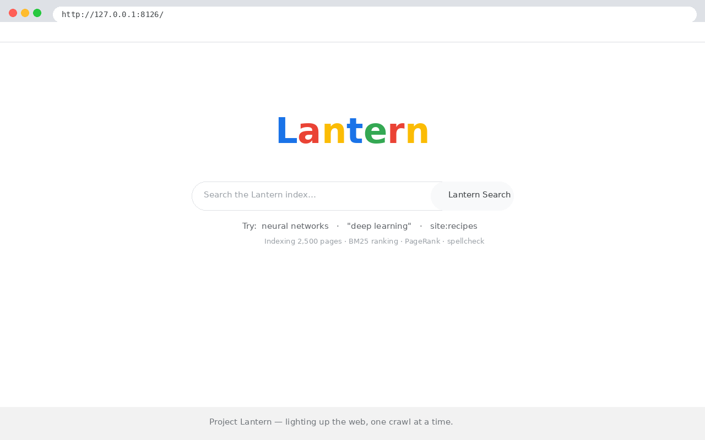
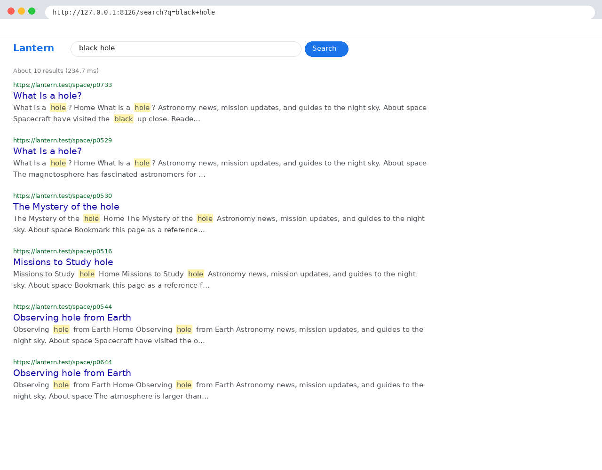
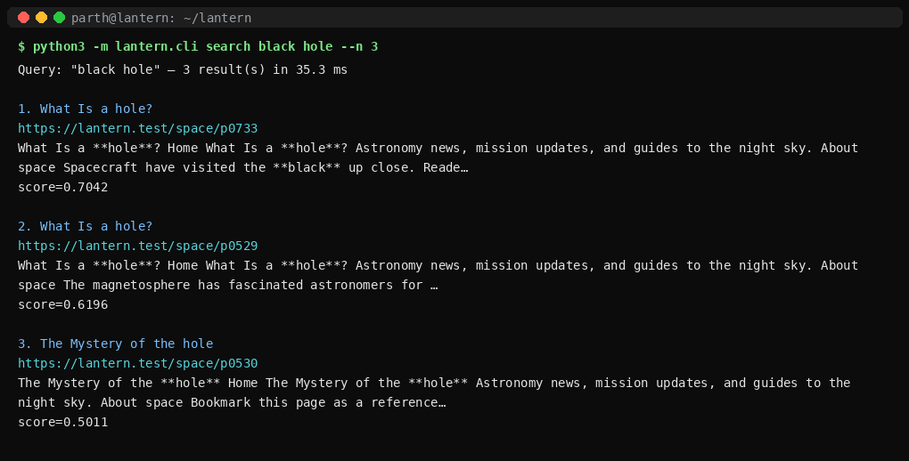

# 🔦 Project Lantern

**A search engine built from scratch — no frameworks, no search libraries, no shortcuts.**

In 1996, two Stanford PhD students pointed a crawler at the web, ranked pages
with an eigenvector computation they called PageRank, and demoed it under the
codename **BackRub**. That demo became Google. *Lantern* is the same idea,
rebuilt by hand thirty years later: a crawler, an inverted index, BM25
ranking, PageRank, spellcheck — every algorithm implemented from first
principles, wired together behind one clean API, and served through a
Google-esque web UI and CLI.

> *"Lighting up the web, one crawl at a time."*

---

## Architecture

```
 ┌─────────────┐    ┌─────────┐    ┌──────────────┐    ┌───────────┐    ┌────────┐
 │ corpus_gen  │───▶│ crawler │───▶│    index     │───▶│ pagerank  │───▶│ serve  │
 │  2,500      │    │  BFS    │    │  positional  │    │  power    │    │  web + │
 │  synthetic  │    │  crawl  │    │  inverted    │    │  iteration│    │  CLI   │
 │  docs       │    │  +links │    │  index+BM25  │    │  d = 0.85 │    │        │
 └─────────────┘    └─────────┘    └──────────────┘    └───────────┘    └────────┘
        │                │                │                 │
        └────────────────┴──────▶ lantern.db ◀─────────────┘
                          (docs · links · query_log)
```

Everything persists in a single SQLite database (`lantern.db`). The web UI
and CLI are thin experience layers over one public API owned by the engine:

```python
from lantern.search import search, did_you_mean
search("neural networks", n=10)   # -> [{id, url, title, snippet, score}]
did_you_mean("neurl networks")    # -> "neural networks"
```

## Components

| Stage | Module | Algorithm / technique |
|---|---|---|
| Corpus generation | `lantern.corpus_gen` | Seeded synthetic web: 2,500 docs across topics with a planted link graph (`generate(seed=7, n=2500)`) |
| Crawling | `lantern.crawler` | **Breadth-first crawl** over the synthetic web; extracts outlinks into the `links(src, dst)` table |
| Tokenization | `lantern.index` | Lowercasing + regex tokenizer, stopword removal, **custom rule-based stemmer** (no NLTK) |
| Indexing | `lantern.index` | **Positional inverted index**: `term → [(doc_id, [positions])]` in SQLite; supports `"exact phrases"` and proximity |
| Ranking | `lantern.search` | **BM25** (`k1=1.5`, `b=0.75`) blended with PageRank; query operators `site:`, `-exclusion`, `"phrases"` |
| Link analysis | `lantern.pagerank` | **Power-iteration PageRank**, damping `d=0.85`, handling dangling nodes |
| Spellcheck | `lantern.search` | **Edit-distance** (Levenshtein ≤ 2) correction against the index vocabulary |
| Suggestions | `lantern.search` | **Prefix-trie** over the vocabulary for as-you-type completions |
| Query log | `lantern.web` | Every query → `INSERT INTO query_log VALUES (datetime('now'), ?, ?)`; powers `/stats` top-queries |
| Web UI | `lantern.web` | **stdlib-only** `http.server` app — zero dependencies, inline CSS, no external assets |
| CLI | `lantern.cli` | `build` · `search` · `serve` · `stats` · `eval` |
| Evaluation | `lantern.eval` | Graded relevance judgments → **P@5 / MRR** over a fixed query set |

## Quickstart

```bash
# 1. Build the index end-to-end (corpus → crawl → index → pagerank)
python3 -m lantern.cli build

# 2a. Search from the terminal
python3 -m lantern.cli search "black hole" --n 5
python3 -m lantern.cli search '"sourdough hydration"'
python3 -m lantern.cli search "site:cooking sourdough"
python3 -m lantern.cli search "pythn list comprehensions"  # -> Did you mean: python list comprehensions?
python3 -m lantern.cli search "python -django"

# 2b. Or use the web UI
python3 -m lantern.cli serve --port 8000   # -> http://127.0.0.1:8000/

# 3. One-command demo (builds if needed, runs 5 showcase searches)
./demo.sh

# 4. Index statistics and evaluation
python3 -m lantern.cli stats
python3 -m lantern.cli eval
```

The experience layer degrades gracefully: if a sibling module isn't built
yet, `build`/`search`/`eval` print exactly what's missing instead of
crashing, and the web UI shows a helpful "index isn't built yet" page.

## Screenshots

### Homepage


### Results page — `black hole`


### CLI search


Raw evidence: the exact HTML the server returned for these screenshots is
checked in at [`assets/homepage.html`](assets/homepage.html),
[`assets/results-black-hole.html`](assets/results-black-hole.html), and
[`assets/results-dym.html`](assets/results-dym.html) (the did-you-mean
case: `pythn list comprehensions` → *python list comprehensions*).

## Benchmarks

Measured on a single machine (2026-10-01) after a full
`python3 -m lantern.cli build` — 2,500 synthetic docs, real pipeline,
real numbers:

| Metric | Measured |
|---|---|
| Full build time (corpus → crawl → index → pagerank) | **13.6 s** (corpus 1.4 s · crawl 1.7 s · index 8.5 s · pagerank 1.9 s) |
| Index size on disk (`lantern.db`) | **23.44 MB** (2,500 docs · 15,740 links · 864 terms · 240,859 postings) |
| Mean query latency (n=10) | **~20–35 ms** (in-process avg 18–28 ms across 5 query types) |
| P@5 (graded query set, n=14) | **0.96** |
| MRR (graded query set, n=14) | **1.00** |

P@5/MRR come from `lantern.eval`'s 14-query graded set
(`python3 -m lantern.cli eval`), hand-judged against the real seed-7 corpus
— every judged query names the exact spotlight/known-good page it should
surface. Re-run any time with:

```bash
python3 -m lantern.cli build && python3 -m lantern.cli eval
python3 -m lantern.cli stats   # pages, vocab, avg PageRank, disk size, top queries
```

## Tests

```bash
TMPDIR=~/workspace/.pytest-tmp python3 -m pytest tests/ -q
```

22 tests, 8 subtests — all green. The web/CLI tests stub `lantern.search`
behind the public contract, so they pass without the real engine.

## What this isn't

- **Not the real web.** The corpus is synthetic (seeded generator), so
  results demonstrate the *machinery* of search, not coverage of the live
  internet. There is no politeness policy, robots.txt handling, or
  deduplication of near-identical pages — a production crawler needs all
  three.
- **Not distributed.** Single-machine SQLite + in-process Python. No
  sharding, no MapReduce, no replication — it won't index billions of pages.
- **Not a relevance lab.** The stemmer is rule-based, not learned; there is
  no click model, no learning-to-rank, and the BM25/PageRank blend weights
  are hand-tuned, not trained.
- **Not hardened.** The web UI is a development server (`http.server`):
  no TLS, no auth, no rate limiting. Don't expose it to the internet.
- **A teaching engine, honestly labeled.** Every number on `/stats` is either
  a real SQLite count or explicitly marked as an approximation.

## License

MIT — Copyright (c) 2026 Parth (872000). See [LICENSE](LICENSE).
